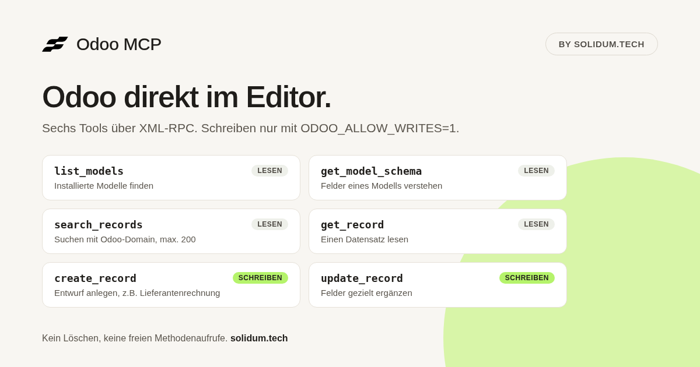
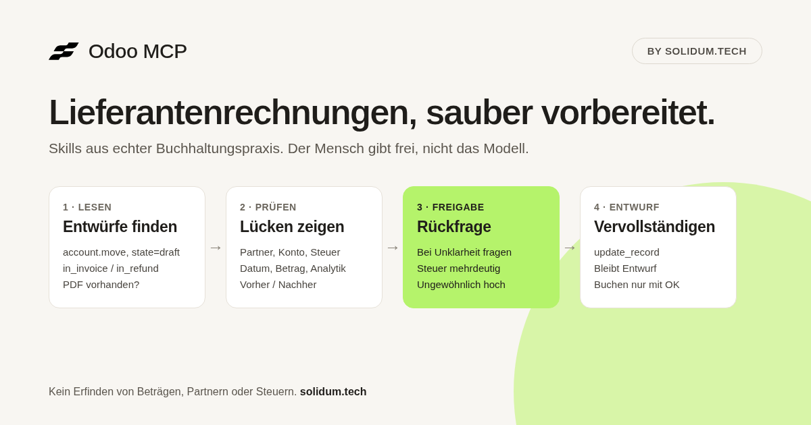

<p align="center">
  <a href="https://solidum.tech"></a>
</p>

# Odoo MCP by Solidum

Odoo direkt aus Cursor, Grok Bot oder jedem anderen MCP-Client: Datensätze suchen, lesen und auf Wunsch Entwürfe anlegen oder ergänzen. Dazu kommen Skills, Regeln und ein Agent für die tägliche Buchhaltung, entstanden aus echter Praxis mit Lieferantenrechnungen, Bankabgleich und Stripe-Gebühren.

Gebaut und gepflegt von **[Solidum](https://solidum.tech)**. Wir übernehmen bestehende Software, stabilisieren sie und entwickeln sie weiter. Festes Team, Ansprechpartner in Deutschland. Von uns gebaut und betrieben unter anderem [meinfahrer.app](https://meinfahrer.app) und [clean-click.de](https://clean-click.de).

> **Eure Odoo-Instanz oder Software braucht mehr als einen Connector?**
> Wir starten mit einem kurzen **Befund**: was läuft, was wackelt, was es kostet. Danach entscheidet ihr, ob wir **übernehmen**.
> **[solidum.tech](https://solidum.tech)**



## Was drin ist

| Teil | Inhalt |
|---|---|
| MCP Server | Python stdio Server, spricht XML-RPC mit Odoo. Sechs Tools, Schreiben nur mit Freischaltung. |
| Rules | `odoo-accounting-safety` (immer aktiv), `solidum-branding` |
| Skills | `vendor-bill-triage`, `bank-and-payment-match`, `stripe-fee-booking`, `odoo-mcp-setup` |
| Agent | `accounting-assistant`: Buchhaltung auf Deutsch, Zahlen zuerst |
| Commands | `/odoo-draft-bills`, `/odoo-open-matches` |

## Tools

| Tool | Art | Was es tut |
|---|---|---|
| `list_models` | lesen | Installierte Modelle auflisten (optional mit Namensfilter) |
| `get_model_schema` | lesen | Felddefinitionen eines Modells (`fields_get`) |
| `search_records` | lesen | `search_read` mit Odoo-Domain; Limit maximal 200 |
| `get_record` | lesen | Einen Datensatz per id lesen |
| `create_record` | **schreiben** | Datensatz anlegen, gibt die neue id zurück |
| `update_record` | **schreiben** | Felder eines Datensatzes ändern |

Die Schreib-Tools sind immer sichtbar, laufen aber nur mit `ODOO_ALLOW_WRITES=1`. Löschen und freie Methodenaufrufe gibt es nicht. Buchen, Abgleichen und Stornieren passiert also immer in Odoo durch einen Menschen.

## Installation

Voraussetzung: [uv](https://docs.astral.sh/uv/) ist installiert. Der Server läuft über `uvx` direkt aus diesem Repo.

### Cursor Plugin

Das Repo ist ein Cursor Plugin (`.cursor-plugin/plugin.json`) und ein Marketplace mit einem Plugin (`.cursor-plugin/marketplace.json`). Das Plugin registriert den MCP Server aus [`mcp.json`](mcp.json) sowie Rules, Skills, Agent und Commands. Der Server liest die `ODOO_*` Variablen aus der Umgebung, mit der Cursor gestartet wurde.

### Cursor manuell (`mcp.json`)

In `~/.cursor/mcp.json` (global) oder `.cursor/mcp.json` (Projekt):

```json
{
  "mcpServers": {
    "odoo": {
      "command": "uvx",
      "args": ["--from", "git+https://github.com/bethesna-dev/odoo-mcp", "odoo-mcp"],
      "env": {
        "ODOO_URL": "https://mycompany.odoo.com",
        "ODOO_DB": "mycompany",
        "ODOO_USERNAME": "bot@mycompany.com",
        "ODOO_API_KEY": "${env:ODOO_API_KEY}"
      }
    }
  }
}
```

Für einen lokalen Checkout: `"command": "uv", "args": ["run", "--directory", "/path/to/odoo-mcp", "odoo-mcp"]`.

### Grok Bot und andere MCP-Clients

Derselbe Server funktioniert in jedem Client, der stdio MCP Server starten kann. In Grok Bot per AddMcpServer mit stdio-Transport:

```bash
ODOO_URL=https://mycompany.odoo.com \
ODOO_DB=mycompany \
ODOO_USERNAME=bot@mycompany.com \
ODOO_API_KEY=... \
uvx --from git+https://github.com/bethesna-dev/odoo-mcp odoo-mcp
```

Den API-Key nicht in die Client-Konfiguration schreiben, sondern aus der Umgebung oder einem Secret Store laden. Details im Skill [`odoo-mcp-setup`](skills/odoo-mcp-setup/SKILL.md).

## Konfiguration

| Variable | Pflicht | Hinweis |
|---|---|---|
| `ODOO_URL` | ja | z.B. `https://mycompany.odoo.com` |
| `ODOO_DB` | ja | Name der Datenbank |
| `ODOO_USERNAME` | ja | Login des Odoo-Users |
| `ODOO_API_KEY` | eins von beiden | Empfohlen. In Odoo unter *Einstellungen → Kontosicherheit → Neuer API-Schlüssel* |
| `ODOO_PASSWORD` | eins von beiden | Nur genutzt, wenn `ODOO_API_KEY` fehlt |
| `ODOO_ALLOW_WRITES` | nein | `1` schaltet `create_record` / `update_record` frei |

Empfehlung: eigener Odoo-User für den Bot mit nur den nötigen Rechten. Erst lesend testen, am besten auf Staging, dann Schreiben freischalten. Zugangsdaten gehören in die Shell-Umgebung, eine lokale `.env` (git-ignored) oder einen Secret Store, nie ins Repo.

## Buchhaltung: Skills, Regeln, Agent



Die Inhalte kommen aus dem Betrieb von Odoo-Buchhaltungsbots bei Solidum-Kunden, verallgemeinert und ohne Kundendaten.

**Rules**

- [`odoo-accounting-safety`](rules/odoo-accounting-safety.mdc): nichts erfinden (Beträge, Partner, Steuern), Entwurf vor Buchung, Freigabe bei großen, ungewöhnlichen oder steuerlich unklaren Fällen, bei Abschreibungen und Stornos. Stripe nie netto buchen. Nie Secrets ausgeben.
- [`solidum-branding`](rules/solidum-branding.mdc): Kontext zum Plugin und zu Solidum, ruhiger Ton, Deutsch wenn der Nutzer Deutsch schreibt.

**Skills**

- [`vendor-bill-triage`](skills/vendor-bill-triage/SKILL.md): unvollständige Lieferantenrechnungen prüfen (Partner, Konten, Steuern, Analytik, Daten, Beträge, PDF), Entwurf vorbereiten, Vorher / Nachher berichten.
- [`bank-and-payment-match`](skills/bank-and-payment-match/SKILL.md): Bankzeilen und Zahlungen offenen Posten zuordnen. Nur eindeutige Treffer gelten als Treffer, der Rest wird als Kandidatenliste gezeigt.
- [`stripe-fee-booking`](skills/stripe-fee-booking/SKILL.md): Stripe-Auszahlungen in Brutto, Gebühren und Auszahlung zerlegen. Gebühren nie im Umsatz verstecken.
- [`odoo-mcp-setup`](skills/odoo-mcp-setup/SKILL.md): Einrichtung in Cursor, Grok Bot und anderen Clients, Fehlersuche.

**Agent**

- [`accounting-assistant`](agents/accounting-assistant.md): arbeitet die Queue ab (Lieferanten-Entwürfe → Bank / Stripe → Kundenzahlungen), berichtet Zahlen zuerst, erfindet nichts und ändert keine gebuchten Belege.

**Commands**

- [`/odoo-draft-bills`](commands/odoo-draft-bills.md): Entwürfe von Lieferantenrechnungen auflisten und prüfen.
- [`/odoo-open-matches`](commands/odoo-open-matches.md): offene Bankzeilen und Zahlungen mit Zuordnungsvorschlägen, nur lesend.

## Screenshots und Assets

| Datei | Zweck |
|---|---|
| `assets/screenshots/tools.png` | Listing: die sechs Tools |
| `assets/screenshots/vendor-bill-workflow.png` | Listing: Workflow Lieferantenrechnungen |
| `assets/screenshots/src/` | HTML-Quellen der Screenshots (headless Chrome, 1200×630) |
| `assets/og.png` | Social Preview |
| `assets/logo.svg`, `assets/logo.png` | Solidum Logo |
| `assets/favicon.svg` | Solidum Bildmarke |

## Entwicklung

```bash
uv run --group dev pytest   # Unit Tests, Odoo RPC ist gemockt
uv run odoo-mcp             # stdio Server starten (braucht ODOO_* Umgebung)
```

Aufbau:

- `src/odoo_mcp/client.py`: Konfiguration aus der Umgebung und schlanker XML-RPC Client (stdlib `xmlrpc.client`)
- `src/odoo_mcp/server.py`: MCP Tool-Definitionen (`mcp` SDK 2.x `MCPServer`)
- `tests/`: Tests mit gemockten XML-RPC Proxies, kein Odoo nötig
- `rules/`, `skills/`, `agents/`, `commands/`: Cursor Plugin Inhalte

Issues und Pull Requests gern hier im Repo. Für Projekte rund um Odoo und eure bestehende Software: **[solidum.tech](https://solidum.tech)**.

## Lizenz

MIT
